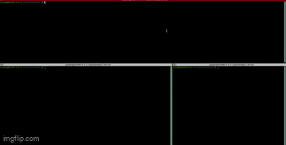

# Devops_deploys
Esta es una práctica para desplegar phpmyfaq en virtual box y vagrant 

Proceso:
1.	Instalación de vagrant en un sistema operativo Linux
2.	Creación de una subcarpeta en la partición opt
3.	Ejecución del comando vagrant init, para crear el archivo Vagrantfile
4.	Ajustar los parámetros del Vagrantfile
5.	Es necesario tener en la misma ubicación del archivo Vagrantfile el script deploy.sh
6.	Ejecutar el comando vagrant up -provisión
7.	Al finalizar utilizar el comando vagrant ssh, para obtener el acceso a la maquina virtual y hacer una prueba con curl
8.	Acceder al sitio phpmyfaq por medio de http:/localhost8888/setup/index.php

